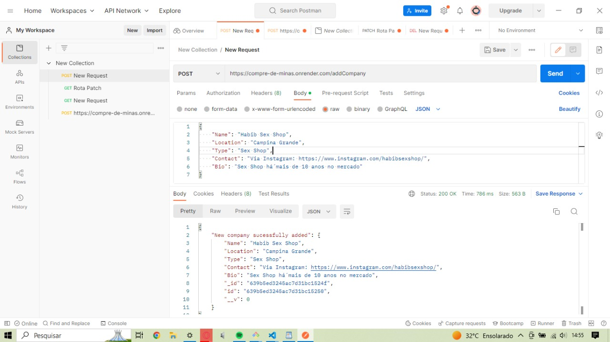
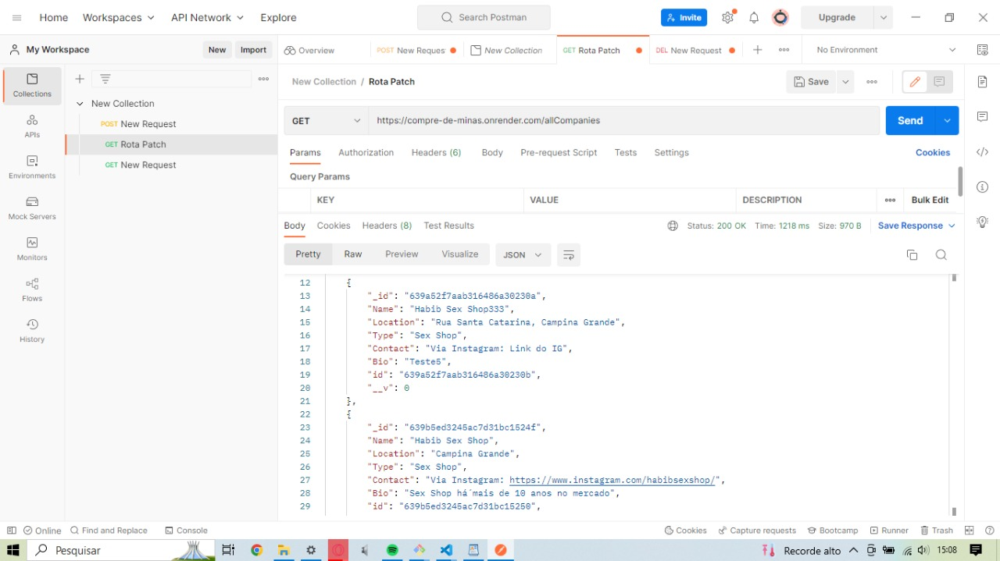
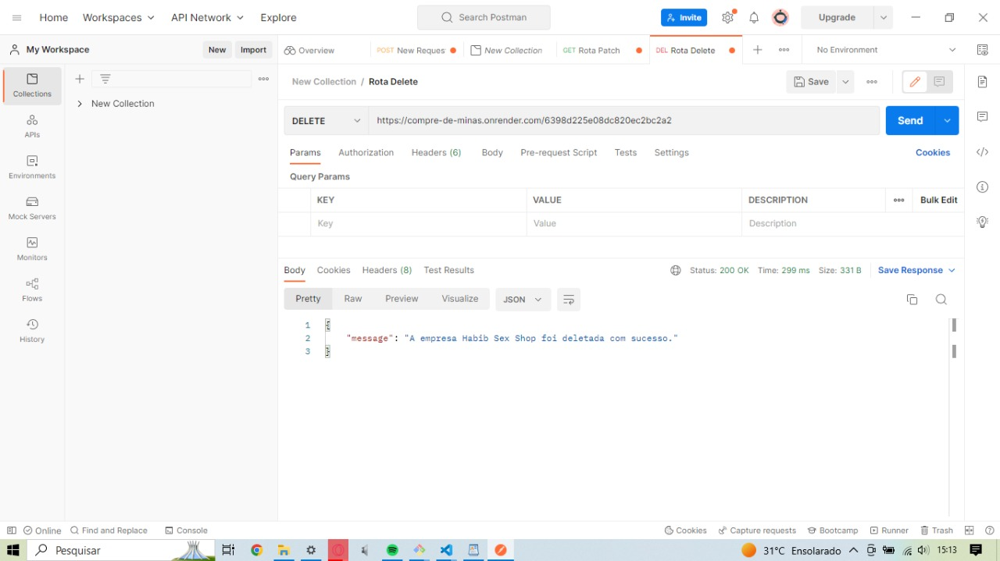
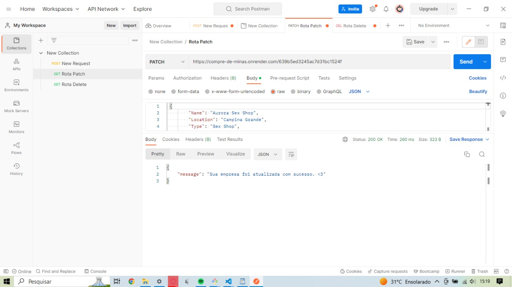
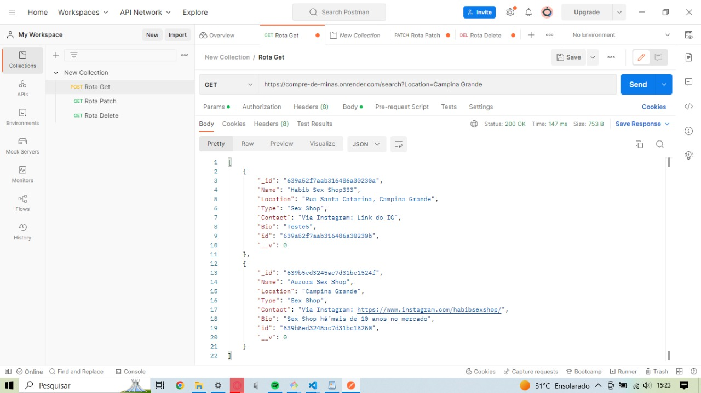
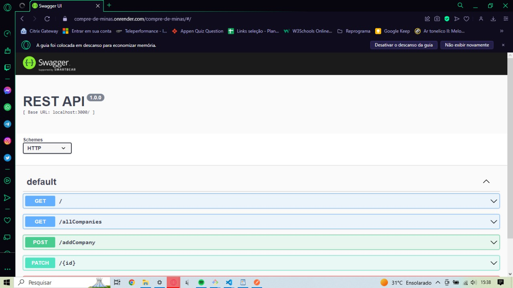
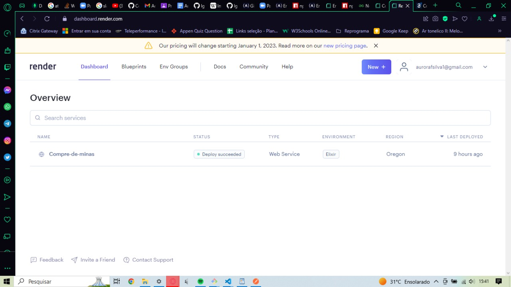

<h1 align="center"> Compre de minas </h1>

# Apresentação

Meu nome é Aurora Felix, tenho 26 anos, sou Potiguar e sou graduada em Psicologia pela Universidade Federal de Campina Grande. Me aproximei da Psicologia quando tinha 18 anos, inspirada pelo desejo de mudar as coisas, a vontade de construir um mundo melhor para as gerações que vem depois de mim e nesse processo construir lugares seguros para as gerações que vieram antes de mim. Vi na Psicologia a potência da mudança, o trabalho transformador que é possível dentro e fora das quatro paredes de um atendimento psicoterapêutico tradicional. Minha transição de carreira para a área tech acontece por um motivo parecido, percebo nessa nova área a mesma potência de poder criar ferramentas que produzem mudanças significativas na vida de outras pessoas. 
É desse desejo que nasce o "Compre de minas", projeto idealizado por mim e construído graças ao incentivo da Reprograma, este tem como objetivo criar uma API que possibilita a consulta de lojas gerenciadas por mulheres em diversas localidades do Brasil e com diversos públicos e produtos diferentes. Essa API surge também a partir do reconhecimento do peso que a identidade tem hoje na decisão de como as pessoas usam seu poder de compra e da vontade de criar um espaço que facilita as investidas de empreemdimento feminino em todo o Brasil. No momento a API ainda dá passinhos pequenos de bebê com uma amostra irrisória de lojas quando comparado ao numero de lojas que ela pode ter um dia, mas é um esqueleto para que no futuro ela possa se tornar uma plataforma que auxilie na divulgação desses empreendimentos.

## Rotas do projeto

    

## Arquivos adicionais

## Agradecimentos

Essa jornada não teria sido possivel sem o batalhão de pessoas investidas na minha formação e na formação de minhas companheiras de turma, dessa forma gostaria de usar esse momento final para agradecer à toda equipe da Reprograma por sua dedicação. Em especial, gostaria de agradecer a 3 mulheres em específico: 
- Jani, minha querida. Foi com você que realmente pude sentir qual era o propósito da Reprograma. Muito obrigada por todo seu carinho, sua atenção a todas e sua dedicação incrível mesmo quando você não estava se sentindo bem. Minha trajetória na Reprograma não teria sido metade do que foi sem você como facilitadora. Um abraço gigante.
- Suziki, doce como uma bala de limão. Queria agradecer imensamente pelo seu compromisso com a nossa turma, em todas suas aulas dava para sentir o quanto você se importava com o conteúdo que você tava ensinando e o quanto que você queria que nós produzessemos códigos de qualidade. Tem projetos lindos saindo da On19 e em cada um deles eu tenho certeza que tem um pouquinho de Suziki. Você é com certeza uma profissional que inspira outras mulheres.
- Para Gaia Maria me falta até palavras. Gaia se dedicou de corpo inteiro e suas aulas foram um sopro de ar fresco para mim, em poucas aulas você conseguiu acalmar meu coração que vinha apertado diante de tanto contéudo para aprender. Nunca achei que ia conseguir aprender banco de dados sorrindo a aula inteira do jeito que foi. Você é um simbolo de competência e uma potência gigante na área Tech. Muito obrigada por toda a ajuda enquanto professora e monitora. Guardo um carinho imenso por tu e só te desejo sucesso.
Por fim, gostaria de agradecer as minhas companheiras de classe, minhas companheiras de guerra. Sou grata por cada encontro que tivemos juntas, sou grata por ter escutado vocês em cada encontro, por cada colaboração e contribuições feitas em aula, por cada história que pude ouvir e por cada risada que compartilhamos. Sigo mais forte pois não ando só, carrego comigo um pedacinho de cada uma de vocês pro resto da minha vida. Properidade para nós sempre!

%20%E2%80%A2%20Instagram%20photos%20and%20videos.jpg)
